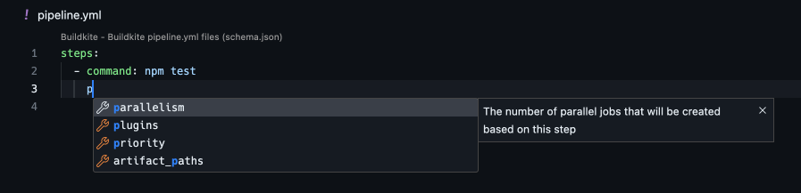

# Buildkite Pipeline JSON Schema

[](https://buildkite.com/buildkite/pipeline-schema)

A [JSON Schema](https://json-schema.org) for Buildkite’s [pipeline file format](https://buildkite.com/docs/pipelines/defining-steps), covering all current, documented options.



See

- [Schema](schema.json)
- [Example valid pipelines](test/valid-pipelines)

## Usage

### npm package

The schema is provided as a [package on npm](https://www.npmjs.com/package/buildkite-pipeline-schema).

You can install it in your project:

```sh
npm i buildkite-json-schema
```

```js
// CommonJS
const schema = require("buildkite-pipeline-schema");

// ESM
import schema from "buildkite-json-schema" assert { type: "json" };
```

Or use it with via a CDN:

```json
{
  "$schema": "https://unpkg.com/buildkite-pipeline-schema@latest/schema.json"
  // ...
}
```

### Editor integration

You can lint and validate your `pipeline.yml` files using an editor extension that supports [RedHat YAML Language Server](https://github.com/redhat-developer/yaml-language-server#clients).

#### VSCode

Install the [YAML VSCode Extension by Red Hat](https://marketplace.visualstudio.com/items?itemName=redhat.vscode-yaml).

If the schema isn't picked up automatically, click _No JSON Schema_ in the status bar from your `pipeline.yml`, and select _Buildkite_.

### Install with npm

```sh
npm install buildkite-pipeline-schema
```

## Development

### Testing

With [Node 16+](https://nodejs.org/en/) installed,i nstall dependencies:

```sh
npm install
```

Run tests:

```sh
npm test
```

Alternatively, tests can be run with [Docker Compose](https://docs.docker.com/compose/):

```sh
docker-compose run --build --rm app
```

## Contributing

Bug reports and pull requests are welcome, see [CONTRIBUTING.md](./.github/CONTRIBUTING.md).

### Contributors

Many thanks to our fine contributors!

A full list can be found [here](https://github.com/buildkite/pipeline-schema/graphs/contributors), but you're all amazing, and we greatly appreciate your input.

## Releasing

```sh
# Version bump the code, tag and push
npm version [major/minor/patch]
git push && git push --tags

# Publish to the NPM registry
npm publish

# Create a new GitHub release
open "https://github.com/buildkite/pipeline-schema/releases"
```

## License

The package is available as open source under the terms of the [MIT License](./LICENSE.md).
