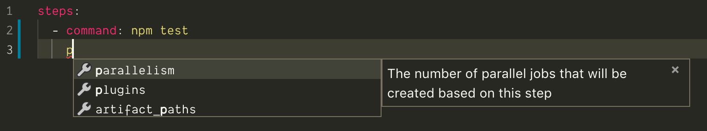

# Buildkite Pipeline JSON Schema [](https://buildkite.com/buildkite/pipeline-schema)

A [JSON Schema](https://json-schema.org) for Buildkite’s [pipeline file format](https://buildkite.com/docs/pipelines/defining-steps), covering all current, documented options. Useful for linting/validating your pipeline.yml files using tools like [YAML VSCode Extension by Red Hat](https://marketplace.visualstudio.com/items?itemName=redhat.vscode-yaml).



See:

* [schema.json](schema.json)
* [test/valid-pipelines](test/valid-pipelines)

## Testing

If you have [Node 10+](https://nodejs.org/en/) installed:

```shell
cd test
npm install && npm test
```

Or you can use [Docker Compose](https://docs.docker.com/compose/):

```shell
cd test
docker-compose build && docker-compose run --rm tests
```

## Contributing

See [contributing.md](./contributing.md)

## Contributors

Many thanks to our fine contributors! A full list can be found [here](https://github.com/buildkite/pipeline-schema/graphs/contributors), but you're all amazing, and we greatly appreciate your input ❤️
