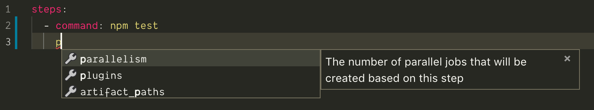

# Buildkite Pipeline JSON Schema [](https://buildkite.com/buildkite/pipeline-schema)

A [JSON Schema](https://json-schema.org) for Buildkite’s [pipeline file format](https://buildkite.com/docs/pipelines/defining-steps), covering all current, documented options. Useful for linting/validating your pipeline.yml files using tools like [YAML VSCode Extension by Red Hat](https://marketplace.visualstudio.com/items?itemName=redhat.vscode-yaml).



See:

* [schema.json](schema.json)
* [test/valid-pipelines](test/valid-pipelines)

## Go validation

The repository is also a Go package that embeds `schema.json` and validates pipeline YAML or JSON locally, without network access. The schema version is pinned by the version of this module used by your application.

```go
package main

import (
	"errors"
	"fmt"
	"os"

	pipelineschema "github.com/buildkite/pipeline-schema"
)

func main() {
	data, err := os.ReadFile(".buildkite/pipeline.yml")
	if err != nil {
		panic(err)
	}

	if err := pipelineschema.Validate(data); err != nil {
		var validationErr *pipelineschema.ValidationError
		if errors.As(err, &validationErr) {
			for _, violation := range validationErr.Violations {
				location := violation.InstanceLocation
				if location == "" {
					location = "/"
				}
				fmt.Printf("document %d at %s: %s\n", violation.Document, location, violation.Message)
			}
			os.Exit(1)
		}
		panic(err)
	}
}
```

Validation covers documented pipeline syntax. Successful validation does not guarantee that the Buildkite API will accept a pipeline, because API-side and semantic checks may also apply.

## Testing

Run the Go package tests from the repository root:

```shell
go test ./...
```

To run the schema tests with [Node.js](https://nodejs.org/en/) installed:

```shell
cd test
npm install && npm test
```

Or you can use [Docker Compose](https://docs.docker.com/compose/):

```shell
cd test
docker-compose build && docker-compose run --rm tests
```

## Formatting

This project uses [prettier](https://prettier.io/) to format the codebase. To format the codebase, run:

```sh
cd test
# verify that formatting is correct
npm run format:check
# rewrite files with pretty-printing
npm run format:write
```

## Contributing

See [contributing.md](./contributing.md)

## Contributors

Many thanks to our fine contributors! A full list can be found [here](https://github.com/buildkite/pipeline-schema/graphs/contributors), but you're all amazing, and we greatly appreciate your input ❤️
